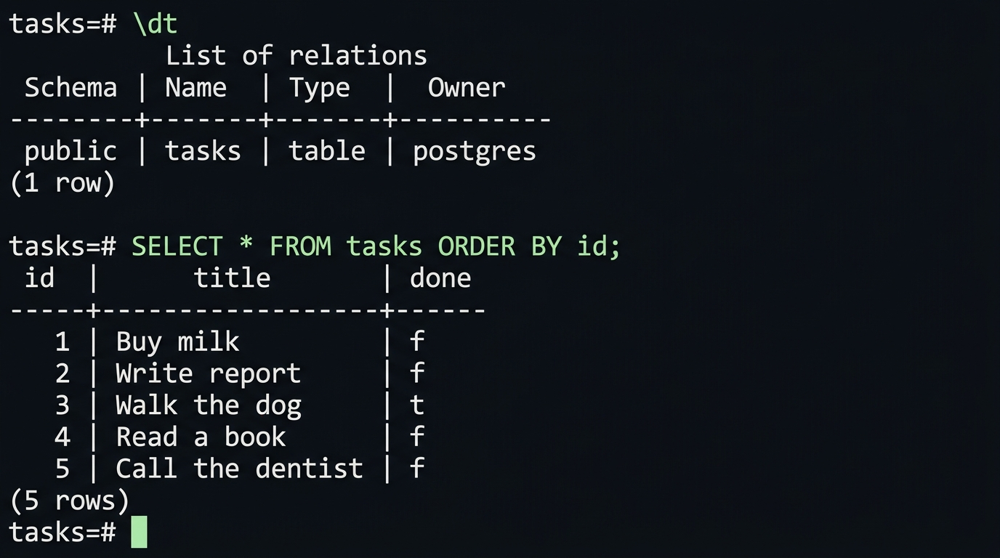

# Task API — Postgres in Docker

A CRUD API for a to-do list (FastAPI + PostgreSQL). This is the third storage swap
in the same project: **memory (A1) → SQLite (A2) → containerized Postgres (A3)**.
The endpoints never changed — only `repository.py` (the one module that talks to
the database) and a few infrastructure files.

## Run everything with one command

Requires [Docker Desktop](https://www.docker.com/products/docker-desktop/) (or Podman).

```bash
cp .env.example .env     # then edit the password in .env
docker compose up
```

- API: http://localhost:8000  ·  Swagger UI: http://localhost:8000/docs
- The `tasks` table is created automatically and 3 example tasks are seeded **only when the table is empty**.
- Data lives in the `taskdata` Docker volume, so it survives `docker compose down` + `up`.
  (`docker compose down -v` deletes the volume — and your data.)

## Configuration (`.env`)

Secrets live in `.env`, which is git-ignored. `.env.example` is committed with placeholders.

| Variable | Used by | Meaning |
|---|---|---|
| `POSTGRES_USER` / `POSTGRES_PASSWORD` / `POSTGRES_DB` | compose | credentials for the `db` container; compose also builds the API's connection string from them |
| `DATABASE_URL` | local runs | connection string when you run `uvicorn` on your machine against the container (`localhost:5432`) |

Inside the compose network the API reaches Postgres at host **`db`** (the service name), not `localhost`.

## Running the API without Docker for the app (optional)

```bash
docker compose up db -d            # just the database
pip install -r requirements.txt
uvicorn main:app --reload --port 8000
```

## Endpoints

| Method | Path | Description | Success | Errors |
|---|---|---|---|---|
| GET | `/` | API description | 200 | — |
| GET | `/health` | Health check, runs `SELECT 1` | 200 | 503 if DB down |
| GET | `/tasks` | List all tasks | 200 | — |
| GET | `/tasks/{id}` | Get one task | 200 | 404 unknown id |
| POST | `/tasks` | Create (`{"title": "..."}`) | 201 | 400 missing/empty title |
| PUT | `/tasks/{id}` | Update `title` and/or `done` | 200 | 400 invalid body, 404 unknown id |
| DELETE | `/tasks/{id}` | Delete | 204 | 404 unknown id |

Every error returns JSON: `{"error": "..."}`. All queries are parameterized (`%s` placeholders).

## Example `curl -i`

```
$ curl -i -X POST http://localhost:8000/tasks -H "Content-Type: application/json" -d '{"title":"Buy eggs"}'

HTTP/1.1 201 Created
content-type: application/json

{"id":6,"title":"Buy eggs","done":false}
```

## Data in the database

Connect with psql (or any Postgres GUI) to inspect the data at any time:

```bash
docker compose exec db psql -U postgres -d tasks
```

The screenshot below was taken **after** running `docker compose down` and `docker compose up` again — the 5 rows are still there because the data lives in the `taskdata` Docker volume, not in the container.



To verify persistence yourself:

```bash
# 1. start the stack and create a few tasks via POST /tasks
docker compose up -d

# 2. stop everything (keeps the volume)
docker compose down

# 3. start again — your rows should still be there
docker compose up -d
curl http://localhost:8000/tasks   # all tasks present
```

> **Note:** `docker compose down -v` removes the volume and wipes all data.

## Project layout

```
main.py          routes (unchanged shapes from A1/A2)
repository.py    ALL database code: connect, create table, seed, CRUD
Dockerfile       builds the API image
compose.yaml     api + db services, with a volume and a DB healthcheck
.env.example     committed template; copy to .env (git-ignored)
```

## Notes

- **Startup order:** `api` waits for the `db` healthcheck (`pg_isready`) before starting, and `init_db()` also retries the connection, so `docker compose up` works from a cold start.
- **Why a volume:** a container's filesystem dies with the container. The named volume `taskdata` is mounted at `/var/lib/postgresql/data`, so rows outlive the container.
- **Seeding is transactional:** the emptiness check and the 3 inserts run in one transaction — all or nothing.

## AI vs me

_(Optional Stage 6 bonus — not completed here.)_
