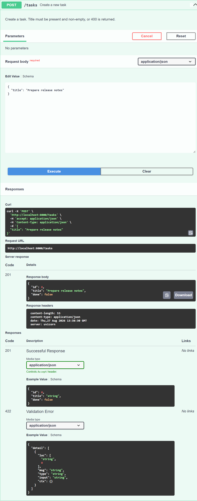
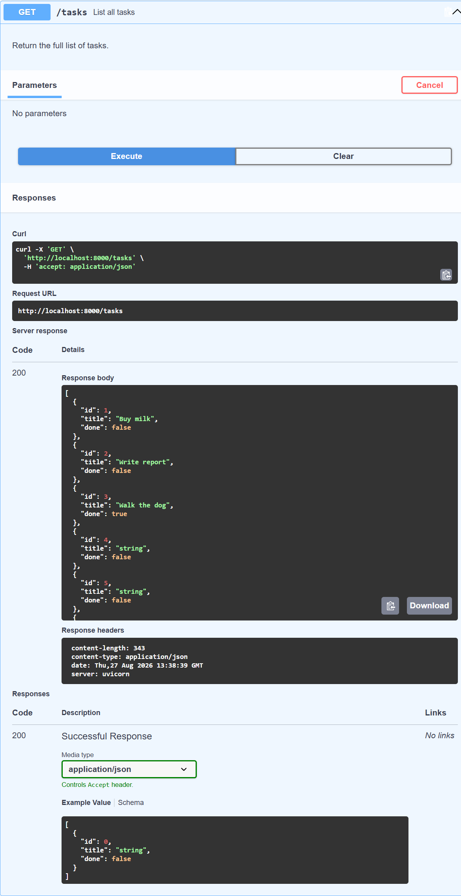
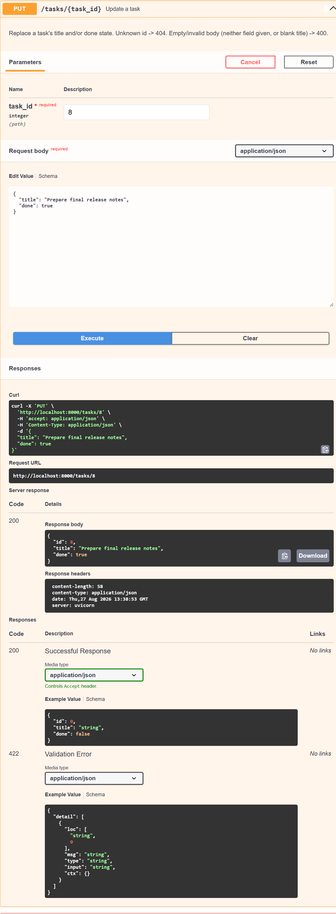
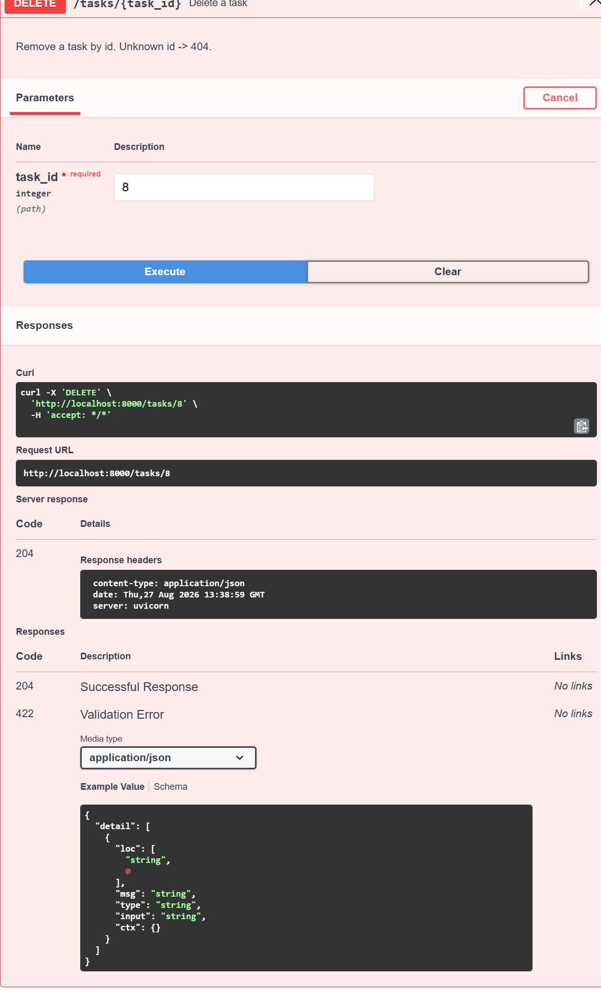

# Task API

A small in-memory CRUD API for managing a to-do list, built with **FastAPI** (Python).
Built for FlyRank Internship — Backend Track, Week 2, Assignment A1.

## What this is

A REST API with full CRUD (Create, Read, Update, Delete) on a to-do list of tasks.
Data is stored **in memory only** — it resets every time the server restarts (no
database yet, that's next week).

## How to run it

Requires Python 3.10+.

```bash
# 1. Install dependencies
pip install -r requirements.txt

# 2. Start the server
uvicorn main:app --reload --port 8000
```

Then open:
- **http://localhost:8000/** — API description
- **http://localhost:8000/health** — health check
- **http://localhost:8000/docs** — Swagger UI (interactive API docs, built in for free by FastAPI)

## Endpoints

| Method | Path            | Description                          | Success  | Errors               |
|--------|-----------------|---------------------------------------|----------|-----------------------|
| GET    | `/`             | API description                       | 200      | —                     |
| GET    | `/health`       | Health check                          | 200      | —                     |
| GET    | `/tasks`        | List all tasks                        | 200      | —                     |
| GET    | `/tasks/{id}`   | Get one task                          | 200      | 404 unknown id        |
| POST   | `/tasks`        | Create a task (`{"title": "..."}`)    | 201      | 400 missing/empty title |
| PUT    | `/tasks/{id}`   | Update a task's `title` and/or `done` | 200      | 400 invalid body, 404 unknown id |
| DELETE | `/tasks/{id}`   | Delete a task                         | 204      | 404 unknown id        |

Task shape: `{ "id": number, "title": string, "done": boolean }`

## Example: curl -i output

```
$ curl -i -X POST http://localhost:8000/tasks \
    -H "Content-Type: application/json" \
    -d '{"title":"Buy milk"}'

HTTP/1.1 201 Created
content-type: application/json

{"id":4,"title":"Buy milk","done":false}
```

```
$ curl -i http://localhost:8000/tasks/99

HTTP/1.1 404 Not Found
content-type: application/json

{"error":"Task 99 not found"}
```

## Swagger screenshot

The full CRUD cycle was tested in Swagger UI using **Try it out**. The screenshots
below show the same task being created, read, updated, and deleted:

### Create — POST `/tasks`



### Read — GET `/tasks`



### Update — PUT `/tasks/{task_id}`



### Delete — DELETE `/tasks/{task_id}`



## Notes

- The 3 seed tasks (`Buy milk`, `Write report`, `Walk the dog`) are recreated
  every time the server starts — restarting the server loses any tasks you added.
  That's the "mortality experiment" this assignment points at: in-memory storage
  doesn't survive a restart, which is exactly why databases exist (Week 3).
- Input validation: `POST`/`PUT` reject a missing or blank `title` with `400` and
  a JSON `{"error": "..."}` body, never a silent success.
